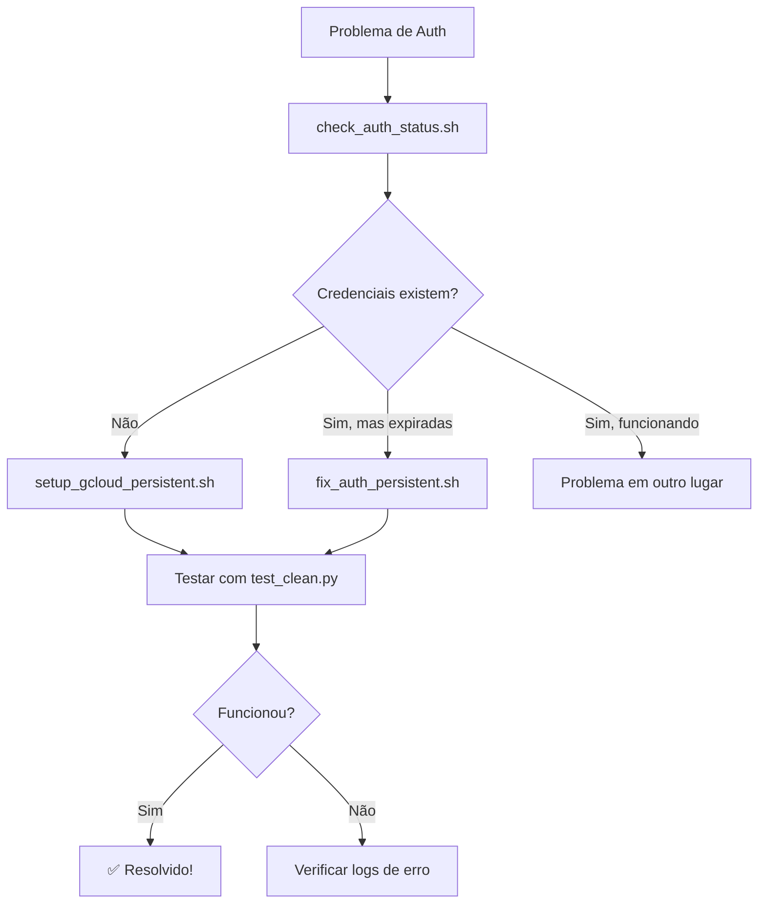

# 🔐 Guia de Autenticação Google Cloud

Este guia explica como resolver problemas de autenticação com o Google Cloud Vision API no seu projeto PDF OCR.

## 📋 Scripts Disponíveis

### 1. `./check_auth_status.sh` - Diagnóstico Rápido

Verifica o status atual da autenticação e identifica problemas.

```bash
./check_auth_status.sh
```

**Use quando:**

- Não tem certeza se a autenticação está funcionando
- Quer fazer um diagnóstico completo
- Está debugando problemas de credenciais

### 2. `./setup_gcloud_persistent.sh` - Configuração Inicial

Configura a autenticação pela primeira vez ou reconfigura completamente.

```bash
./setup_gcloud_persistent.sh
```

**Use quando:**

- É a primeira vez configurando o projeto
- Quer fazer uma configuração limpa do zero
- Mudou de conta Google

### 3. `./fix_auth_persistent.sh` - Correção de Credenciais Expiradas

Corrige problemas quando as credenciais já existem mas expiraram.

```bash
./fix_auth_persistent.sh
```

**Use quando:**

- Vê erro "503 Getting metadata from plugin failed"
- Vê erro "Reauthentication is needed"
- As credenciais existem mas não funcionam

## 🚨 Resolução do Seu Problema Atual

Baseado no erro que você está vendo:

```
❌ Erro: 503 Getting metadata from plugin failed with error: Reauthentication is needed. Please run `gcloud auth application-default login` to reauthenticate.
```

**Siga estes passos:**

### Passo 1: Diagnóstico

```bash
./check_auth_status.sh
```

### Passo 2: Correção das Credenciais

```bash
./fix_auth_persistent.sh
```

### Passo 3: Testar Novamente

```bash
python test_clean.py
```

## 🔍 Entendendo os Erros Comuns

### Erro 503 - Reauthentication is needed

**Causa:** As credenciais existem mas expiraram
**Solução:** Execute `./fix_auth_persistent.sh`

### DefaultCredentialsError

**Causa:** Nenhuma credencial configurada
**Solução:** Execute `./setup_gcloud_persistent.sh`

### Permission denied

**Causa:** Conta sem permissões no projeto
**Solução:** Use uma conta pessoal Gmail ou solicite acesso

### Project not found

**Causa:** Projeto ID incorreto ou inacessível
**Solução:** Verifique se o projeto existe e você tem acesso

## 📁 Arquivos Importantes

- `/app/gcloud-config/` - Volume persistente com credenciais
- `/root/.config/gcloud/` - Diretório local do gcloud
- `application_default_credentials.json` - Arquivo principal de credenciais

## 💡 Dicas de Solução de Problemas

1. **Sempre use contas pessoais Gmail** se tiver problemas com contas organizacionais
2. **Credenciais são salvas persistentemente** no volume Docker
3. **Reautenticação é mais rápida** que reconfiguração completa
4. **Use o diagnóstico primeiro** para identificar o problema exato

## 🔄 Fluxo de Troubleshooting



## 🆘 Se Nada Funcionar

1. Verifique se o Google Cloud Vision API está habilitado no projeto
2. Confirme que a conta tem permissões no projeto `stable-chain-455617-v1`
3. Tente usar uma conta Google pessoal diferente
4. Verifique se não há firewall bloqueando as conexões

## 📞 Comandos de Emergência

Se tudo der errado, use estes comandos para resetar completamente:

```bash
# Limpar tudo
rm -rf /app/gcloud-config/*
rm -rf /root/.config/gcloud/*

# Reconfigurar do zero
./setup_gcloud_persistent.sh
```
